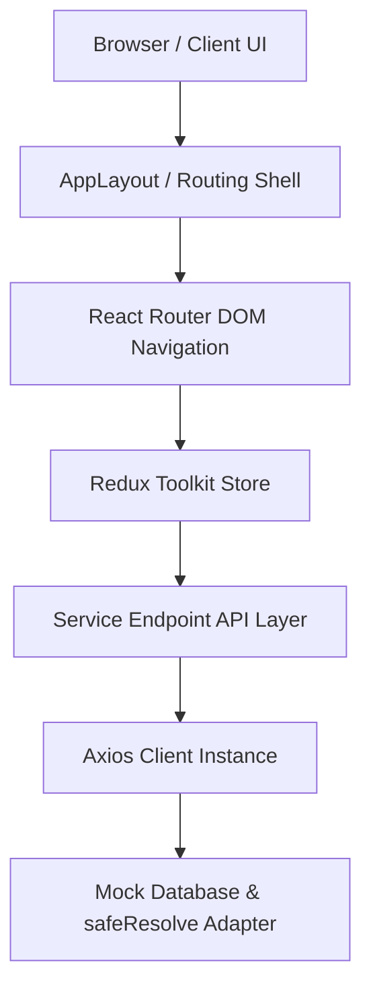
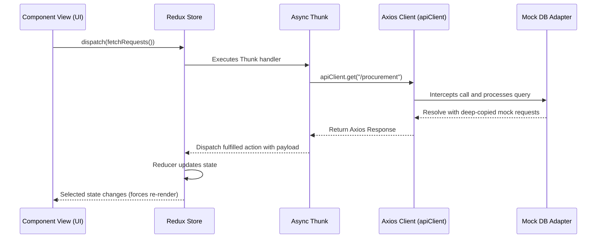
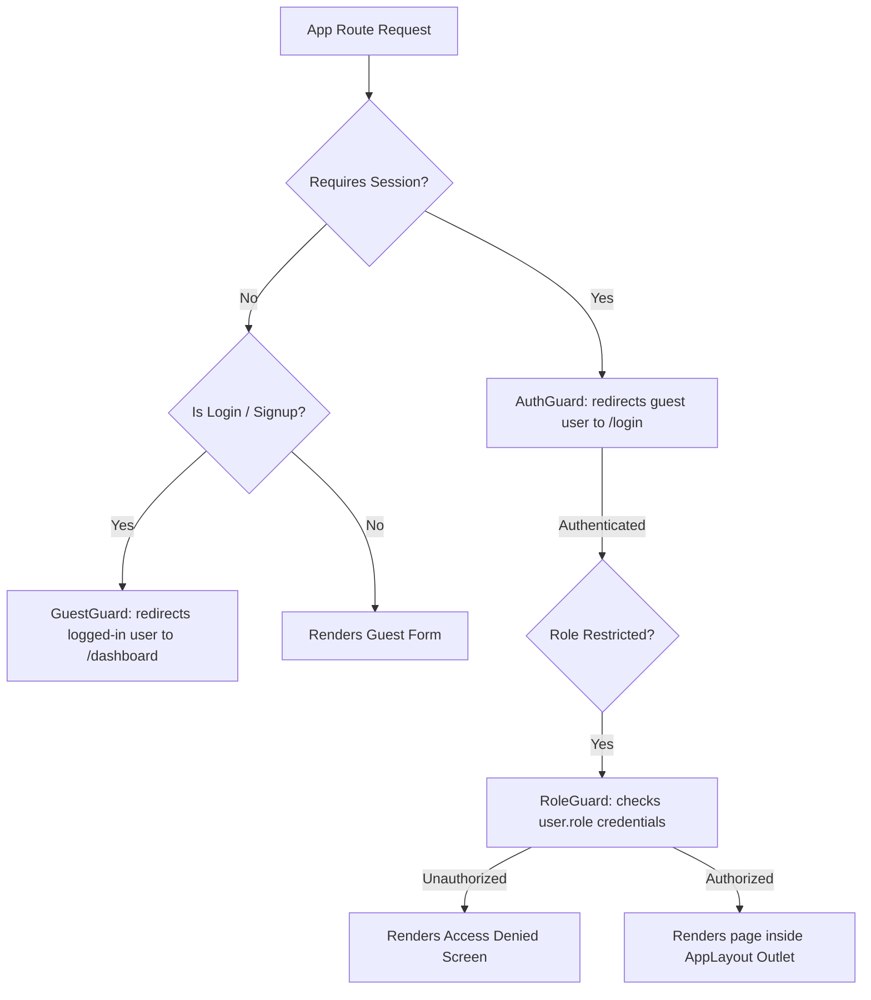
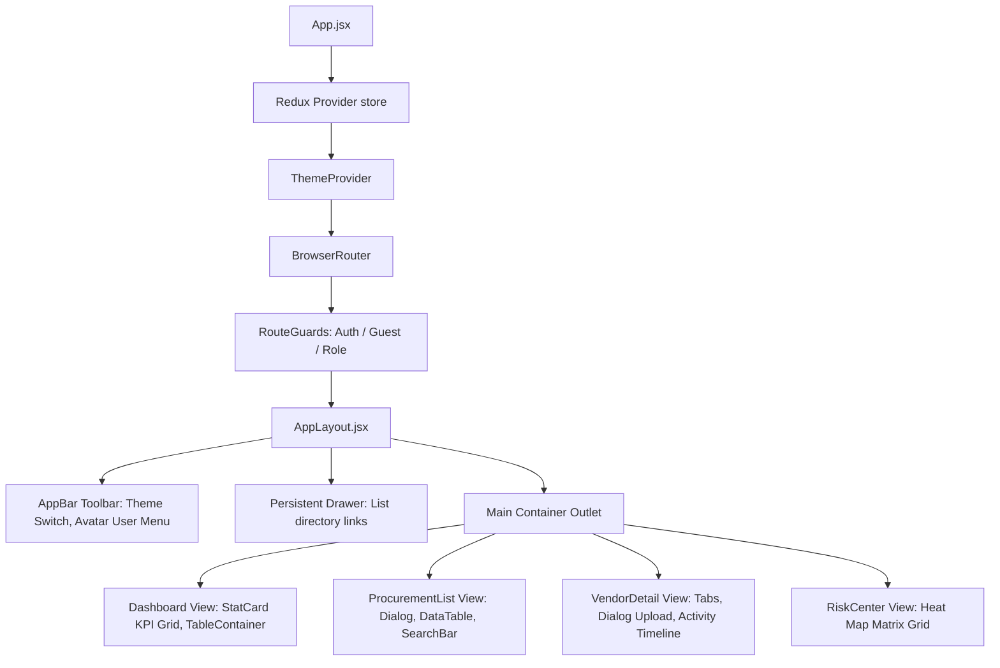

# e-GRCP Enterprise Platform

An industry-standard, enterprise-grade SaaS application for **Enterprise Governance, Risk, Compliance, and Procurement (e-GRCP)**. 

Built using **React 19**, **Redux Toolkit**, **React Router DOM**, **Material UI**, and **React Hook Form**.

---

## 1. Product Vision & Problem Statement

### Why this product exists
In large multinational companies, handling procurement requests, onboarding vendors, verifying regulatory compliance, and maintaining audit trails through manual processes (emails, scattered spreadsheets, and local shared drives) leads to:
* **Approval Delays**: Lost requests, slow manager response cycles, and lack of routing transparency.
* **Compliance Issues**: Working with suspended/expired vendors or lacking active certificates (SOC 2, ISO 27001).
* **Risk Blindness**: No visibility into the risk profile of procurement transactions.
* **Audit Gaps**: Inability to reconstruct step-by-step decision histories for regulatory auditors.

### The Solution
This platform centralizes these activities into one unified dashboard, introducing:
1. **Automated Approval Workbench**: Enabling manager routing (Approve, Reject, Send Back, Delegate).
2. **Vendor Governance Vault**: Tracks vendor profiles and manages compliance certificate uploads.
3. **5x5 Risk Heat Map Matrix**: Provides visual clustering of requests based on Likelihood and Impact.
4. **Compliance Center & Violations Manager**: Scans and flags expired certs or suspended vendors.
5. **System Audit Trail & Export**: Logs every action and supports full CSV reporting for internal and external auditors.

---

## 2. Project Architecture & Folder Structure

This application is built using a scalable **Feature-Based Architecture**:

```
src/
├── components/          # Reusable presentation components
│   ├── DataTable.jsx    # Custom table with pagination, sorting, search, & CSV export
│   ├── Modal.jsx        # Accessible dialog wrapper
│   ├── SearchBar.jsx    # Custom search input
│   ├── KpiCard.jsx      # Generic stats counter card
│   ├── Loader.jsx       # Fallback loading skeleton spinner
│   └── ErrorState.jsx   # Error fallback view with manual retries
├── features/            # Feature-based modular business logic
│   ├── audit/           # Audit Center view & logs table
│   ├── auth/            # Login, Signup, & Forgot Password forms
│   ├── compliance/      # Compliance violations dashboard & checklist
│   ├── dashboard/       # Overview counts and recent request activities
│   ├── procurement/     # Purchase requests workspace, details, & approval workbench
│   ├── reports/         # Dynamic CSV report query forms
│   ├── risk/            # 5x5 Likelihood/Impact heat map matrix
│   ├── settings/        # System preferences & theme controls
│   └── vendors/         # Vendor profile vault & certification uploads
├── layouts/             # AppLayout.jsx (Header, notifications, sidebar navigation)
├── routes/              # Routing & RouteGuards.jsx (AuthGuard, GuestGuard, RoleGuard)
├── services/            # Axios setup & API service layer
│   ├── apiClient.js     # Axios instance, interceptors, and local mock DB adapter
│   ├── authService.js   # User auth service endpoints
│   ├── vendorService.js # Vendor registration and documents endpoints
│   └── ...              # Other feature services
├── store/               # Redux state configuration & slices
└── tests/               # Jest & React Testing Library unit test suites
```

---

## 3. Tech Stack & Implementation Details

### State Management (Redux Toolkit)
* Global state is managed using Redux Toolkit slices (`createSlice`, `createAsyncThunk`) to manage asynchronous lifecycles.
* Persistent state (active user session, sidebar status, selected theme) is synced automatically using `redux-persist`.
* State is divided into clean, decoupled slices for each feature (e.g. `procurementSlice`, `vendorSlice`, `notificationSlice`).

### Routing & Security
* Client-side routing is handled by `react-router-dom`.
* Role-based permissions are enforced via `RoleGuard`. Views and operations are restricted based on user role (`Employee`, `Procurement Manager`, `Compliance Officer`, `Auditor`, `Administrator`).

### Service Integration & Mock DB
* Uses an Axios instance with preconfigured request and response interceptors to automatically attach session headers.
* Relies on a local mock database adapter in `apiClient.js` mimicking actual REST API latency, with deep-copying techniques preventing React state mutations from freezing the local database.

---

## 4. Getting Started & Setup

### Prerequisites
* [Node.js](https://nodejs.org/) (v18 or higher recommended)
* npm (v9 or higher)

### Installation
1. Clone the repository:
   ```bash
   git clone https://github.com/vinaycm166/react-project.git
   cd react-project
   ```

2. Install dependencies:
   ```bash
   npm install
   ```

3. Run the development server:
   ```bash
   npm run dev
   ```
   Open [http://localhost:5173](http://localhost:5173) in your browser.

### Running Unit Tests
The project features complete testing suites (Components, Redux Slices, API Service Layer, and Form UI validation):
```bash
npm run test
```

### Building for Production
To compile production assets:
```bash
npm run build
```
Production output is located in the `dist/` directory.

---

## 5. User Roles & Login Credentials

Use the following user credentials to test different system privileges in the login screen:

| Username | Password | Role | Department |
| :--- | :--- | :--- | :--- |
| `employee` | `password` | Employee | Engineering |
| `manager` | `password` | Procurement Manager | Procurement |
| `compliance` | `password` | Compliance Officer | Compliance & Legal |
| `auditor` | `password` | Auditor | Internal Audit |
| `admin` | `password` | Administrator | IT Operations |

---

## 6. System Architecture & Flow Diagrams

These diagrams are written in Mermaid notation and will render natively on GitHub.

### Overall System Architecture
Describes the structural layout of the application frontend modules and mock database layers:



### Redux Async Data Flow
Describes the cycle of user action triggering, async dispatching, mock request resolution, state mutations, and view updates:



### React Router & Guarding Flow
Describes how user sessions are checked and navigated inside AppLayout:



### Component Hierarchy Diagram
Describes the DOM tree structure of parent and child components inside the layout shell:



